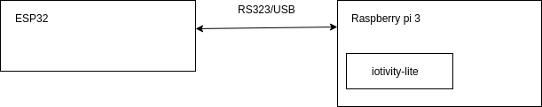

## Gardener

This project was created for learning [iotivity-lite](https://github.com/iotivity/iotivity-lite)

## Build for raspberry pi

```bash
    mkdir example && cd example
    git clone --recursive git@github.com:rafajpet/gardener.git
    cd deps/iotivity-lite/port/linux/
    sudo make CLOUD=1 SECURE=0 DEBUG=1 MNT=1 install
    cd ./example
    mkdir build 
    cd cmake && cmake ..
    make
```
    
## Build for esp32    
   
1, Install visual code
2, install platform.io extention
3, import poject from folder ./esp32-switch
4, build & flash     
       
## Run
    
1, Connect esp32 board into raspberry pi via USB
        
 2, Run executable bin in build folder 
    
```bash
./gardener
```
        
This executable run iotivity-lite server and accept resource change via CoAP/UDP
resource change requiest. State of switch transfer via serial link
into esp32 device and change state of GPIO port
    
3, Run command from project [gardener-command](https://github.com/rafajpet/gardener-comand)
    
## Schema



 
    
    


   


